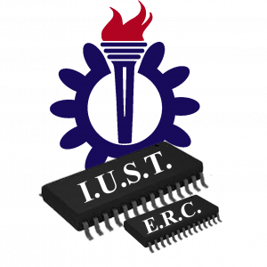
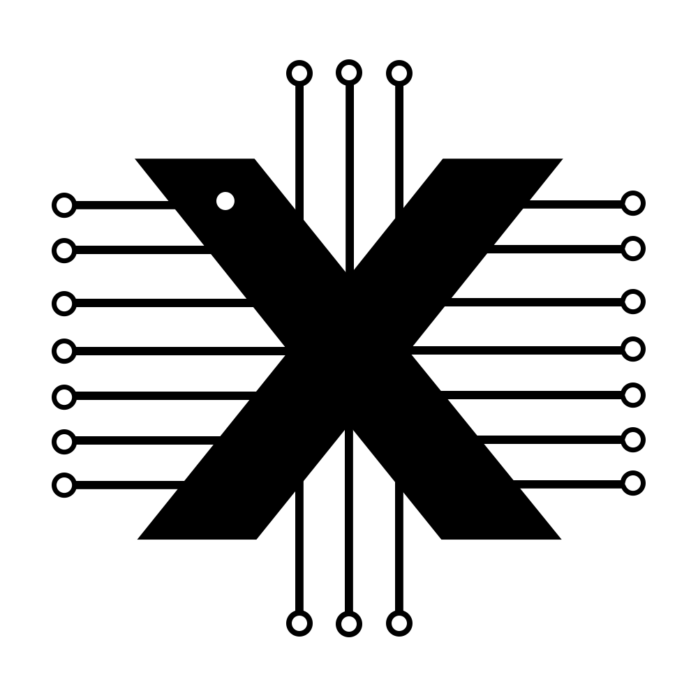

## About

|[About](#about) | [News](/news/NEWS.md) | [Publications](#publications) | [Team](#the-team) | [Contact](#contact-us) |
|:---------------:|:---------------------:|:-----------------------------:|:-----------------:|:----------------------:|

We are a research team located in the [Electronics Research Center](https://erc.iust.ac.ir/index.php?sid=45&slc_lang=fa) at Iran University of Science and Technology (IUST), specializing in computer architecture, high-performance computing, and fault-tolerance in embedded systems. We are passionate about exploring new ideas and developing cutting-edge solutions in these fields. Our projects are open-source, and freely available at our [GitHub page](https://github.com/phoeniX-Digital-Design) along with thorough documentation, user manuals, and detailed information, facilitating user-friendly navigation and ease of use.
 
The **phoeniX** partially-reconfigurable platform includes an `RV32IEM` core designed in Verilog HDL based on the 32-bit Base Instrcution Set of [RISC-V ISA V2.2](http://riscv.org/), with specialized architectural features and an API to support **approximate computing** techniques in a general-purpose processor. This platform enables integration of accurate/approximate arithmetic circuits at the core level, with different structures, accuracies, timings and etc. without any need for modification in rest of the core, especially in the control logic. This allows configurable trade-offs between performance, application-level quality, and energy efficiency based on user-defined requirements. For more details check project's [repository](https://github.com/phoeniX-Digital-Design/phoeniX) and our [publications](#publications)!

## News

- *30 Oct. 2024:* Our team participated in the [IICM 2024](https://iicm-conf.ir/2024) Conference hosted by the University of Tabriz, presenting our latest publications. ([view more](/news/NEWS.md))

- *28 Aug. 2024:* Our team participated in the [Euromicro DSD 2024](https://dsd-seaa.com/dsd2024/) Conference held by Sorbonne University in Paris. Arvin presented our most recent publication with the academic community. ([view more](/news/NEWS.md))

- *24 Dec. 2023:* Highlighting our ongoing research, our team has held a workshop on RISC-V and approximate computing showcasing our work on the phoeniX processor, held by [Electronic Research Center](https://erc.iust.ac.ir/index.php?sid=45&slc_lang=fa) at IUST. ([view more](/news/NEWS.md))

- *27 Nov. 2023:* The phoeniX project is now ONLINE! Check out our project's repository on [GitHub](https://github.com/phoeniX-Digital-Design/phoeniX). ([view more](/news/NEWS.md))

- [View more.](/news/NEWS.md)

## Publications

- [**Evaluation of Run-Time Energy Efficiency using Controlled Approximation in a RISC-V Core**](https://arxiv.org/abs/2410.07027)
    - Arvin Delavari, Faraz Ghoreishy, Hadi Shahriar Shahhoseini and Sattar Mirzakuchaki
    - The 6th Iranian International Conference on Microelectronics (IICM), Tabriz, Iran, 2024

- [**Dynamic Power Control in a Hardware Neural Network with Error-Configurable MAC Units**](https://arxiv.org/abs/2410.10545)
    - Maedeh Ghaderi, Arvin Delavari, Faraz Ghoreishy, and Sattar Mirzakuchaki
    - The 6th Iranian International Conference on Microelectronics (IICM), Tabriz, Iran, 2024

- [**A Reconfigurable Approximate Computing RISC-V Platform for Fault-Tolerant Applications**](https://ieeexplore.ieee.org/abstract/document/10741850/)
    - Arvin Delavari, Faraz Ghoreishy, Hadi Shahriar Shahhoseini and Sattar Mirzakuchaki
    - The 27th Euromicro Conference on Digital System Design (DSD), Paris, France, 2024

- [**PhoeniX: A RISC-V Platform for Approximate Computing Technical Specifications (2023)**](http://www.iust.ac.ir/content/76158/phoeniX-POINTS--A-RISC-V-Platform-for-Approximate-Computing)
    - Arvin Delavari, Faraz Ghoreishy, Hadi Shahriar Shahhoseini and Sattar Mirzakuchaki

## The Team

### Supervising Professors

| Sattar Mirzakuchaki, PhD | Hadi Shahriar Shahhoseini, PhD |
|:------------------------:|:------------------------------:|
||                         |
|Professor                   |Associate Professor             |
|     |  | 

### Research Assistants

| Arvin Delavari    | Faraz Ghoreishy  |Maedeh Ghaderi    |
|:-----------------:|:----------------:|:----------------:|
|         |        |       |
|     |     |     |
| Advanced Microarchitecture, Reconfigurable Computing, VLSI, Fault-Tolerance | Advanced Microarchitecture, Reconfigurable Computing, VLSI, Fault-Tolerance  | Neuromorphic Computing, HW-SW Co-Design, AI Accelerators |

## Contact Us

For any questions or assistance regarding projects, we highly recommend reaching out to the group via [email](mailto:phoenix.digital.electronics@gmail.com) or contacting the team members responsible for each project directly.

We are looking for passionate researchers and students interested in **Computer Architecture**, **SoC Development**, **Compilers and Operating Systems**, **Neuromorphic and AI Accelerators**, and **VLSI** to join our team. Prospective members can contact us at team's [email](mailto:phoenix.digital.electronics@gmail.com) with their CV/Resume.

Current graduate and undergraduate students at IUST are encouraged to directly reach out to [Dr. Mirzakuchaki](mailto:m_kuchaki@iust.ac.ir) or [Dr. Shahhoseini](mailto:shahhoseini@iust.ac.ir) and complete the Electronics Research Center application form.

 

