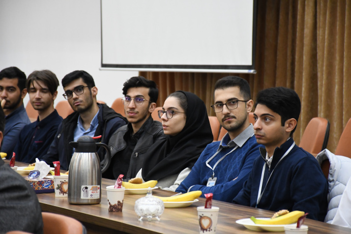
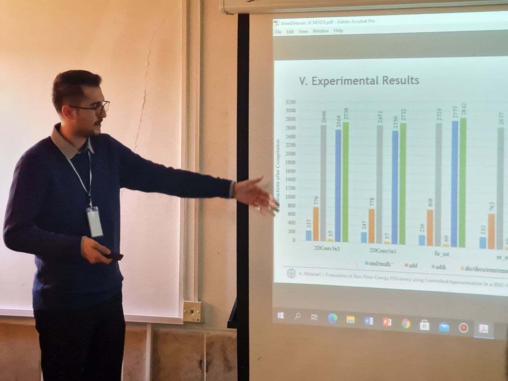
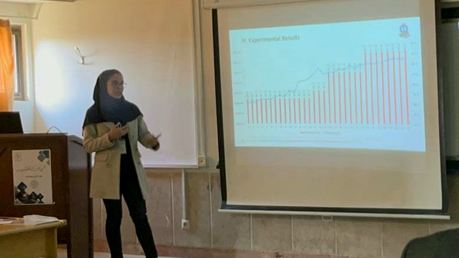
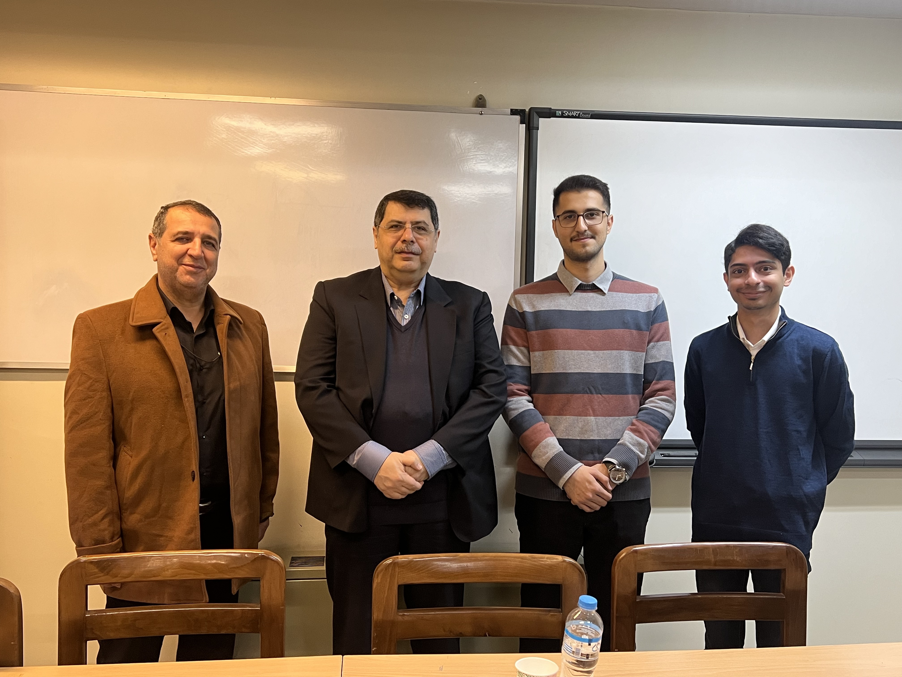
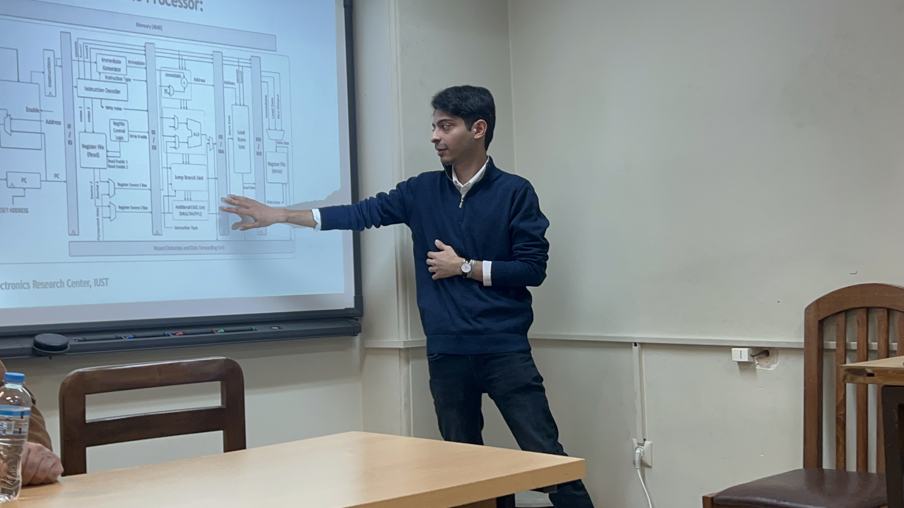
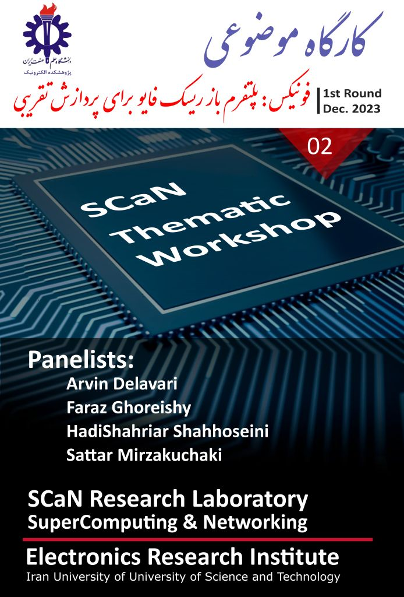
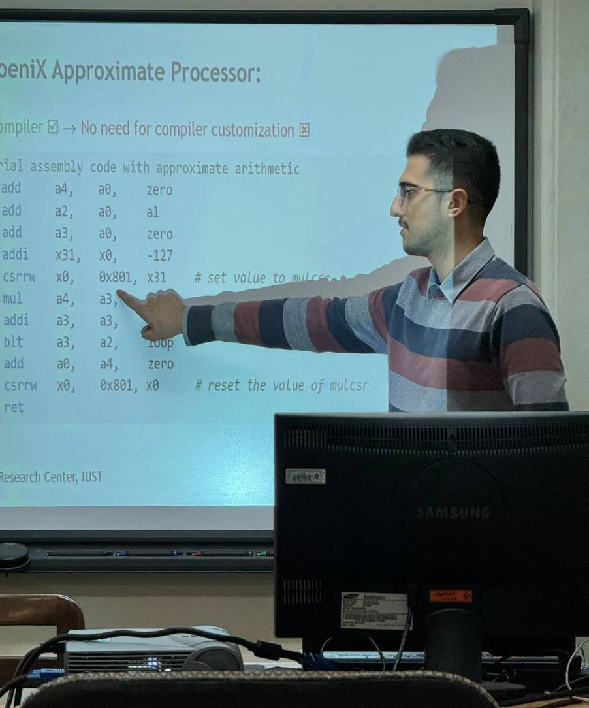

    

        <a href="https://phoenix-digital-design.github.io/" target="blank">
            
Home

        </a>
    

    

        <a href="https://phoenix-digital-design.github.io/news/news.html" target="blank">
            
News

        </a>
    

    

        <a href="https://phoenix-digital-design.github.io/projects/projects.html" target="blank">
            
Projects

        </a>
    

    

        <a href="https://phoenix-digital-design.github.io/software/software.html" target="blank">
            
Software

        </a>
    

    

        <a href="https://phoenix-digital-design.github.io/#the-team" target="blank">
            
The Team

        </a>
    

    

        <a href="https://phoenix-digital-design.github.io/#contact-us" target="blank">
            
Contact Us

        </a>
    

# News

### **30 Oct. 2024** 

Our team participated in the [6th Iranian International Conference on Microelectronics (IICM) 2024](https://iicm-conf.ir/2024) hosted by the University of Tabriz, presenting our latest publications. Arvin presented a paper on the phoeniX platform, named "[Evaluation of Run-Time Energy Efficiency using Controlled Approximation in a RISC-V Core](https://arxiv.org/abs/2410.07027)", and Maedeh presented her paper on utilization of approximate computing in hardware Neural Networks, titled "[Dynamic Power Control in a Hardware Neural Network with Error-Configurable MAC Units](https://arxiv.org/abs/2410.10545)".

### **28 Aug. 2024** 

Our team participated in the [27th Euromicro Conference on Digital System Design (DSD) 2024](https://dsd-seaa.com/dsd2024/) held by Sorbonne University in Paris. Arvin presented our most recent publication "[A Reconfigurable Approximate Computing RISC-V Platform for Fault-Tolerant Applications](https://ieeexplore.ieee.org/abstract/document/10741850/)", and shared our research on the phoeniX platfrom with the academic community.

### **24 Dec. 2023** 

Highlighting our ongoing research, our team has held a workshop on RISC-V and approximate computing showcasing our work on the phoeniX processor, held by [Electronic Research Center](https://erc.iust.ac.ir/index.php?sid=45&slc_lang=fa) at IUST. A huge thank you to all who attended the workshop! We express our deep gratitude for the invaluable support you provided, which played a vital role in our team's accomplishments.

### **27 Nov. 2023** 

The phoeniX project is now **ONLINE**! Check out our latest release on [GitHub](https://github.com/phoeniX-Digital-Design/phoeniX).

[Back to Homepage.](https://phoenix-digital-design.github.io/)